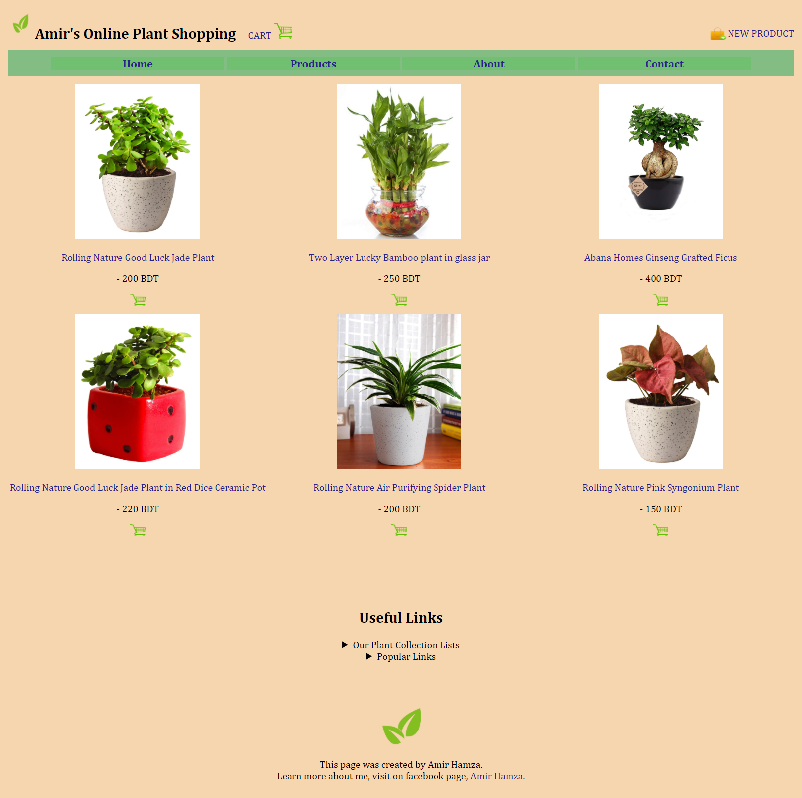
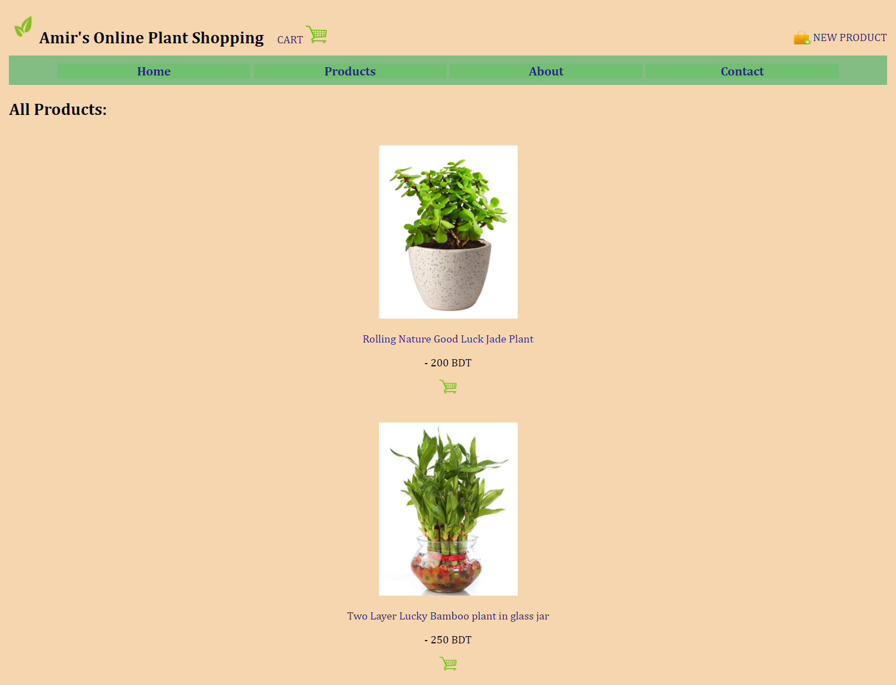
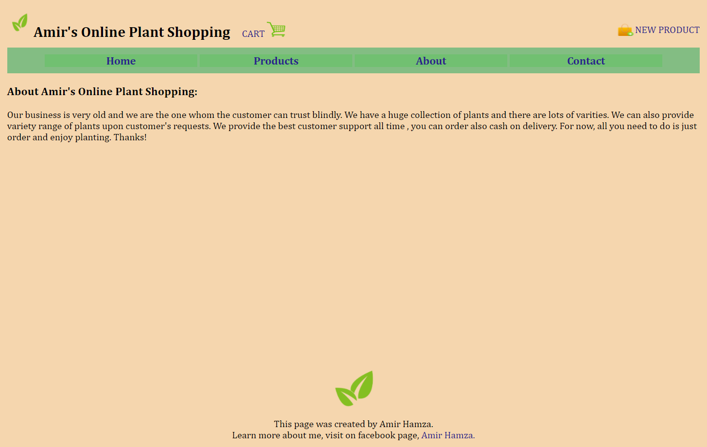
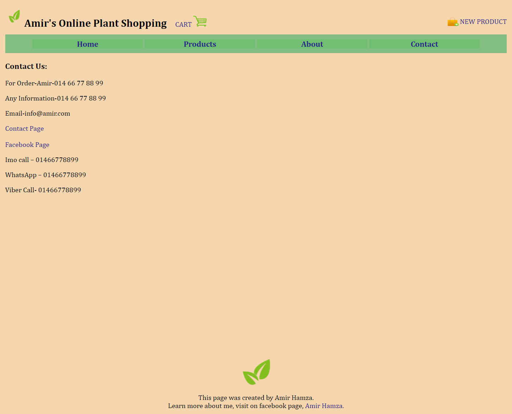
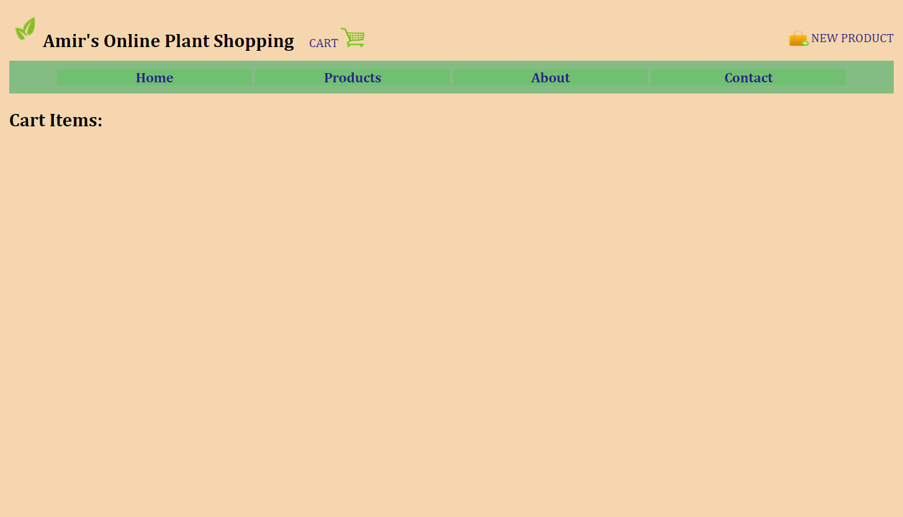
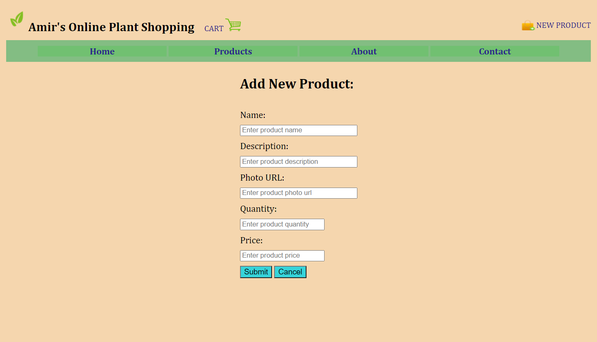
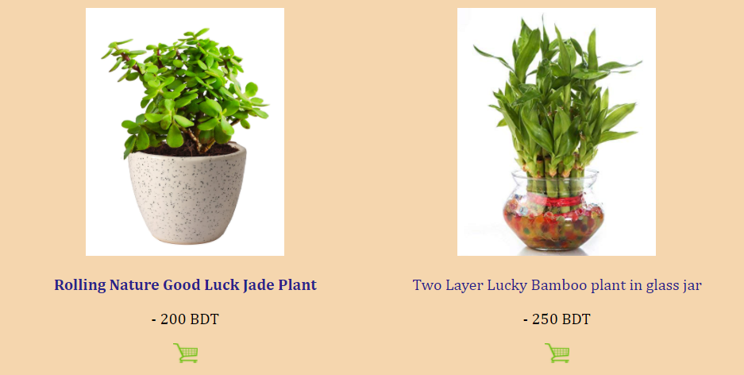
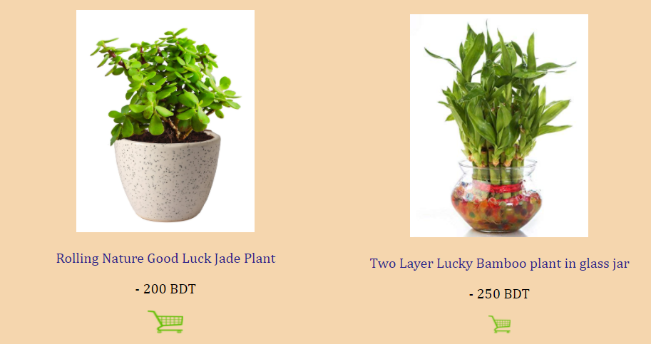

# Online-Plant-Shopping-Front-End-Webpage
This is a webpage of an online plant shopping, where users can get to see all the plant products, their prices and description and they can easily add them to cart as well and view the product for details. Admin can also add various products and delete as well, there are options available as a form. Users can contact as well with the owner for more details.

##  HomePage Includes:
  - The Title with the logo 
  - Upon clicking Cart, it redirects to the Cart page.
  - Upon clicking New Product, it redirects to the new product Form page. 
  - There are Nav bars which includes 4 items, each redirects to its html page. 
  - Useful Links is an option for future modification, to see all the useful links that can help the user to easily find out their desired page. 
  - Popular Links also is an option for future modification, to see all the links that has been clicked most number of times previously by all the users. 
  - Lastly there is a Footer to show the owner of the page.
  
---

##  Products Includes:
  - All the products that are being added will show in this page.
  
---
 
 ##  About Includes:
  - Information about this page.
  
---

 ##  Contact Includes:
  - Contact information.
  
---

 ##  Cart:
  - Products added to the cart will show here.
  
---

 ##  New Product Form:
  - Products can be added also.
  - Form validation has been done.
  
---

 ##  Linking Product name to the Product View page:
  - By hovering the mouse cursor product name will get highlight.
  - Upon clicking it will redirect to the product viewing page.
  
---

 ##  Linking Product Cart:
  - By hovering the mouse cursor cart logo, it will get highlight.
  - Upon clicking it will show a message that it is added to the cart.
  
---
